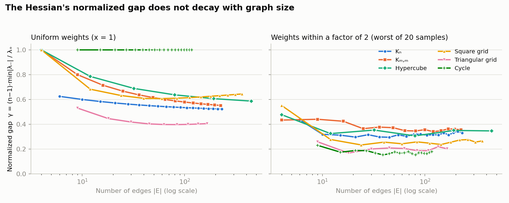

# Matroid Field Theory: Lorentzian Hessians of Graphic Matroids

**Calvin Sabastian Tanzil** · Physics, Institut Teknologi Bandung (ITB)

This repository contains the mathematical core of a research program on basis generating polynomials of graphic matroids: computational checks of a known theorem, new computations around it, and scripts that reproduce every number.

**Start here:** [`ROADMAP.md`](ROADMAP.md), a short letter-style note on the questions behind this repository and where I intend to take them.

---

## Starting point: a known theorem

Let G be a graph with edge set E, |E| = n, and let

$$f_G(x) = \sum_{B \in \mathcal{B}(G)} \prod_{e \in B} x_e$$

be the basis generating (Kirchhoff) polynomial of its graphic matroid, summing over spanning trees B.

**Theorem (Nagaoka–Yazawa; Murai–Nagaoka–Yazawa).** If the matroid is simple (no loops, no parallel edges) and has rank ≥ 2, then for every x in the open positive orthant the Hessian ∇²f_G(x) has signature exactly (1, n − 1). In particular, it is non-degenerate.

- Brändén–Huh (*Ann. of Math.* 192(3), 2020) show the Hessian of a Lorentzian polynomial has exactly one positive eigenvalue on the positive orthant, but it may also have zero eigenvalues. Ruling those out is the content of the theorem above.
- The graphic case was proved by Nagaoka–Yazawa (*J. Algebra* 577, 2021); the general simple-matroid case by Murai–Nagaoka–Yazawa (*J. Combin. Theory Ser. A* 181, 2021). Full citations below.
- **All hypotheses are needed, and bridges are harmless.** A loop or a parallel pair produces a zero eigenvalue; a single edge (rank 1) has zero Hessian. Graphs with bridges, including trees on ≥ 3 vertices, still have signature (1, n − 1). See the verification table below.
- By Euler's identity for homogeneous polynomials, x itself is a positive direction of the Hessian.

**This repository's contribution** is not the theorem itself. It is computational: checks of the hypothesis boundary, measurements of how far from degenerate the Hessian is, the finding that direction-dependent (driven) hopping can destroy the Lorentzian property, and the observation that a genuine lattice chemical potential makes some weights negative (next section). The questions these raise are set out in [`ROADMAP.md`](ROADMAP.md).

## Deformations

Rescaling each variable by a positive edge weight, x_e ↦ w_e x_e, is a nonnegative linear change of variables, so f_G stays Lorentzian (Brändén–Huh). It also preserves simplicity, so the signature theorem applies to the rescaled polynomial. This is a direct corollary.

A symmetric rescaling is **not** a chemical potential. Direction-dependent hopping, e^{+μ} forward and e^{−μ} backward, can enter the Laplacian in two ways, which differ only in the diagonal:

- **Driven deformation.** The diagonal is adjusted so that every column sums to zero (Tutte's directed Laplacian; up to sign and transposition, the generator of a biased random walk). The polynomial stays positive but can **lose** the Lorentzian property: on K₄ it fails at every μ > 0 tested. By Brändén–Huh's Theorem 3.14 it is Lorentzian for every μ ≥ 0 exactly when the forward-edge count s_r is M-concave on spanning trees. (`verification/driven_deformation.py`; [ROADMAP ¶5–8](ROADMAP.md).)
- **Lattice chemical potential** (Hasenfratz–Karsch). The diagonal is left alone. By Kenyon's theorem the determinant is a sum over cycle-rooted spanning forests, with a factor 2 − e^{μℓ} − e^{−μℓ} for each cycle whose net time displacement is ℓ. Real μ makes weights **negative**. Imaginary μ keeps them nonnegative, and the polynomial is then real stable and hence Lorentzian. (`verification/chemical_potential.py`; [ROADMAP ¶14](ROADMAP.md).)

---

## Verification

```bash
pip install -r requirements.txt
cd verification
python hyp_check.py        # signature on 15 graphs, including loops, parallel edges, bridges (symbolic)
python spectral_gap.py     # closed-form Hessian, validated against symbolic; raw gaps for six families
python gap_normalized.py   # normalized gap γ across weight ratios K = 1, 2, 10, 100
python plot_gap.py         # regenerates figures/gap_vs_size.png
python observations.py     # closed forms at uniform weights; exhaustive small-graph scan (ROADMAP ¶9)
python driven_deformation.py  # driven (Tutte) deformation: exact Lorentzian test and the M-concavity criterion (ROADMAP ¶5–7)
python chemical_potential.py   # lattice chemical potential: Kenyon forests, signs at real μ, Lorentzian at imaginary μ (ROADMAP ¶14)
```


| Graph | n = \|E\| | Hypotheses | Signature observed | min \|λ\| / max \|λ\| |
|---|---|---|---|---|
| K₃ | 3 | simple | (1, 2) | 5.0e-1 |
| K₄ | 6 | simple | (1, 5) | 2.6e-2 |
| K₅ | 10 | simple | (1, 9) | 1.7e-2 |
| K₂,₃ | 6 | simple | (1, 5) | 6.3e-3 |
| C₅ | 5 | simple | (1, 4) | 3.9e-3 |
| Diamond | 5 | simple | (1, 4) | 1.9e-2 |
| House | 6 | simple | (1, 5) | 7.6e-3 |
| Bowtie (cut vertex) | 6 | simple | (1, 5) | 9.1e-3 |
| K₃ + pendant edge (bridge) | 4 | simple | (1, 3) | 1.6e-2 |
| Two triangles + bridge | 7 | simple | (1, 6) | 3.4e-3 |
| Star K₁,₃ (tree) | 3 | simple | (1, 2) | 1.7e-3 |
| **Single edge** | 1 | rank 1 | **Hessian = 0** | 0 |
| **K₃ + parallel edge** | 4 | not simple | **(1, 2) + one zero** | ~1e-16 |
| **K₃ + loop** | 4 | not simple | **(1, 2) + one zero** | 0 |

200 random points per graph, uniform in [0.05, 5]ⁿ. Every failure is a case the theorem's hypotheses exclude. Script: `verification/hyp_check.py`.

---

## How far from degenerate? A quantitative question

The theorem above is qualitative: non-degenerate at each point of each finite graph. A continuum limit needs more, namely that the Hessian stays *uniformly* away from degeneracy as the graph grows.

### Closed form

With conductances x > 0, let T be the transfer-current matrix (T_ef = b_eᵀ L⁻¹ b_f, with L the reduced weighted Laplacian and b_e the incidence vector of edge e) and R_e = T_ee the effective resistance of edge e. The matrix-tree theorem and Jacobi's formula give

$$\nabla^2 f_G(x) = f_G(x)\,\big(R R^{\top} - T \circ T\big),$$

where ∘ is the entrywise product. Equivalently, the entries count pairs of edges in a random spanning tree 𝒯 drawn with probability proportional to its weight:

$$\frac{\partial_e \partial_f f_G(x)}{f_G(x)} = \frac{\mathbb{P}(e, f \in \mathcal{T})}{x_e x_f}, \qquad e \neq f,$$

so up to diagonal rescaling the Hessian is the pairwise joint-inclusion matrix of the weighted random spanning tree. This is standard (matrix-tree theorem; Burton–Pemantle transfer-current theorem), not new. It makes the Hessian computable with one linear solve. `verification/spectral_gap.py` checks it against the symbolic Hessian (relative error ~10⁻¹⁶).

### The right measure

The Hessian of a multiaffine polynomial has zero diagonal, so its trace is 0 and its one positive eigenvalue equals the sum of the |negative| ones. Hence min|λ₋| / λ₊ ≤ 1/(n − 1) for **every** graph, and the raw ratio decays trivially. The meaningful quantity is

$$\gamma = (n-1)\,\frac{\min |\lambda_-|}{\lambda_+} \in (0, 1],$$

with γ = 1 exactly when all negative eigenvalues are equal. For the cycle at x = 1 the Hessian is (n − 2)(J − I), so γ = 1.

### Numerical results



Worst γ over 20 random weight vectors with every x_e in [1/K, K] (largest graph tested in each family):

| Family | x = 1 | K = 2 | K = 10 | K = 100 |
|---|---|---|---|---|
| Complete K₂₂ | 0.52 | 0.33 | 0.11 | 1e-2 |
| Complete bipartite K₁₅,₁₅ | 0.55 | 0.36 | 0.10 | 3e-2 |
| Hypercube Q₇ | 0.59 | 0.35 | 0.06 | 8e-4 |
| Square grid 14 × 14 | 0.64 | 0.27 | 0.009 | 2e-5 |
| Triangular grid | 0.41 | 0.20 | 0.011 | 2e-5 |
| Cycle C₁₁₇ | 1 | 0.18 | 0.001 | 1e-7 |

1. **Bounded weight ratios:** γ shows no decay across a roughly 30-fold range of |E| in any family.
2. **Growing weight ratios:** γ collapses, far faster on lattices and cycles than on dense graphs. This matches the mechanism: a very large conductance behaves like contracting an edge, which creates parallel edges, which is the degenerate case.

**Caveats.** These are minima over random samples, not infima; adversarial weights will do worse. Graph sizes are modest. Full data: `verification/gap_normalized.csv`.

**Question.** For a family {G_n} and weights with bounded ratio K, is γ bounded below by a constant c(K) > 0 independent of n? I have not found such a bound in the literature. The known results are qualitative (Murai–Nagaoka–Yazawa), and spectral independence (Anari–Liu–Oveis Gharan; see Štefankovič–Vigoda's notes) bounds the opposite end of the correlation spectrum.

## Formalization (planned)

The first Lean 4 target is a certificate of the K₄ counterexample. Taking e^μ = 2 makes every coefficient rational, so the certificate is a finite, exact computation. The K_n spectrum comes next. When I last checked, Mathlib had matroids but no graphic matroid of a `SimpleGraph` and no basis generating polynomial. See [ROADMAP ¶12](ROADMAP.md).

---

## What is proven, what is proposed

| Status | Content |
|---|---|
| **Known (cited)** | Hessian signature theorem (Nagaoka–Yazawa; Murai–Nagaoka–Yazawa) |
| **Computationally verified** | Signature on the graphs above, including the hypothesis boundary; normalized gap γ bounded in graph size for bounded weight ratios (six families); the driven deformation breaks the Lorentzian property on K₄, K₅, the house and the diamond (for one of two roots), and the M-concavity criterion agrees with the eigenvalue test in 24 of 24 cases; a lattice chemical potential gives negative forest weights at real μ and a Lorentzian polynomial at imaginary μ (small periodic ladders) |
| **Proposal (not a theorem)** | Reading the Hessian as an emergent Lorentzian metric, i.e. a combinatorial model of spacetime |
| **Open (to my knowledge)** | When the forward-edge count s_r is M-concave on spanning trees, i.e. when the driven deformation stays Lorentzian for every μ (Brändén–Huh, Thm 3.14); is triangle-free sufficient? How the imaginary-μ structure breaks down toward real μ; a uniform lower bound on γ for bounded weight ratios; continuum limits |

All results are for finite graphs. The physical interpretation motivates the program, but none of the mathematics above depends on it.

## AI usage

AI assistants (Claude) were used to draft, stress-test arguments, check citations against primary sources, and write verification code. All theorems and proofs were checked by the author.

## References

- P. Brändén, J. Huh, *Lorentzian polynomials*, Ann. of Math. 192(3) (2020), 821–891. [doi:10.4007/annals.2020.192.3.4](https://doi.org/10.4007/annals.2020.192.3.4)
- T. Nagaoka, A. Yazawa, *Strict log-concavity of the Kirchhoff polynomial and its applications to the strong Lefschetz property*, J. Algebra 577 (2021), 175–202. [doi:10.1016/j.jalgebra.2021.01.037](https://doi.org/10.1016/j.jalgebra.2021.01.037), [arXiv:1904.01800](https://arxiv.org/abs/1904.01800)
- S. Murai, T. Nagaoka, A. Yazawa, *Strictness of the log-concavity of generating polynomials of matroids*, J. Combin. Theory Ser. A 181 (2021), 105351. [doi:10.1016/j.jcta.2020.105351](https://doi.org/10.1016/j.jcta.2020.105351), [arXiv:2003.09568](https://arxiv.org/abs/2003.09568)
- N. Anari, S. Oveis Gharan, C. Vinzant, *Log-concave polynomials, I: Entropy and a deterministic approximation algorithm for counting bases of matroids*, Duke Math. J. 170(16) (2021). [doi:10.1215/00127094-2020-0091](https://doi.org/10.1215/00127094-2020-0091), [arXiv:1807.00929](https://arxiv.org/abs/1807.00929)
- N. Anari, K. Liu, S. Oveis Gharan, C. Vinzant, *Log-concave polynomials II: High-dimensional walks and an FPRAS for counting bases of a matroid*, Ann. of Math. 199(1) (2024), 259–299. [doi:10.4007/annals.2024.199.1.4](https://doi.org/10.4007/annals.2024.199.1.4), [arXiv:1811.01816](https://arxiv.org/abs/1811.01816)
- Y.-B. Choe, J. Oxley, A. Sokal, D. Wagner, *Homogeneous multivariate polynomials with the half-plane property*, Adv. Appl. Math. 32(1–2) (2004), 88–187. [doi:10.1016/S0196-8858(03)00078-2](https://doi.org/10.1016/S0196-8858(03)00078-2)
- R. Burton, R. Pemantle, *Local characteristics, entropy and limit theorems for spanning trees and domino tilings via transfer-impedances*, Ann. Probab. 21(3) (1993), 1329–1371. [doi:10.1214/aop/1176989121](https://doi.org/10.1214/aop/1176989121)
- N. Anari, K. Liu, S. Oveis Gharan, *Spectral independence in high-dimensional expanders and applications to the hardcore model*, FOCS 2020; SIAM J. Comput. [doi:10.1137/20M1367696](https://doi.org/10.1137/20M1367696), [arXiv:2001.00303](https://arxiv.org/abs/2001.00303)
- D. Štefankovič, E. Vigoda, *Lecture notes on spectral independence and bases of a matroid: local-to-global and trickle-down from a Markov chain perspective*, [arXiv:2307.13826](https://arxiv.org/abs/2307.13826)
- S. Caracciolo, J. L. Jacobsen, H. Saleur, A. D. Sokal, A. Sportiello, *Fermionic field theory for trees and forests*, Phys. Rev. Lett. 93 (2004), 080601. [doi:10.1103/PhysRevLett.93.080601](https://doi.org/10.1103/PhysRevLett.93.080601), [arXiv:cond-mat/0403271](https://arxiv.org/abs/cond-mat/0403271)
- M. Troyer, U.-J. Wiese, *Computational complexity and fundamental limitations to fermionic quantum Monte Carlo simulations*, Phys. Rev. Lett. 94 (2005), 170201. [doi:10.1103/PhysRevLett.94.170201](https://doi.org/10.1103/PhysRevLett.94.170201), [arXiv:cond-mat/0408370](https://arxiv.org/abs/cond-mat/0408370)
- P. Hasenfratz, F. Karsch, *Chemical potential on the lattice*, Phys. Lett. B 125 (1983), 308–310. [doi:10.1016/0370-2693(83)91290-X](https://doi.org/10.1016/0370-2693(83)91290-X)
- R. Kenyon, *Spanning forests and the vector bundle Laplacian*, Ann. Probab. 39 (2011). [doi:10.1214/10-AOP596](https://doi.org/10.1214/10-AOP596), [arXiv:1001.4028](https://arxiv.org/abs/1001.4028)
- J. Borcea, P. Brändén, *Applications of stable polynomials to mixed determinants: Johnson's conjectures, unimodality, and symmetrized Fischer products*, Duke Math. J. 143 (2008). [doi:10.1215/00127094-2008-018](https://doi.org/10.1215/00127094-2008-018), [arXiv:math/0607755](https://arxiv.org/abs/math/0607755)
- T. Zaslavsky, *Biased graphs. II. The three matroids*, J. Combin. Theory Ser. B 51 (1991), 46–72.
- R. Bauerschmidt, N. Crawford, T. Helmuth, A. Swan, *Random spanning forests and hyperbolic symmetry*, Commun. Math. Phys. 381 (2021), 1223–1261. [doi:10.1007/s00220-020-03921-y](https://doi.org/10.1007/s00220-020-03921-y), [arXiv:1912.04854](https://arxiv.org/abs/1912.04854)
- R. Bauerschmidt, N. Crawford, T. Helmuth, *Percolation transition for random forests in d ≥ 3*, Invent. Math. 237 (2024), 445–540. [arXiv:2107.01878](https://arxiv.org/abs/2107.01878)
